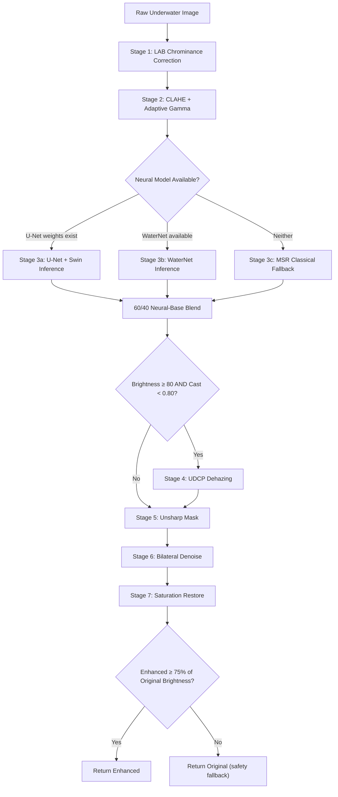
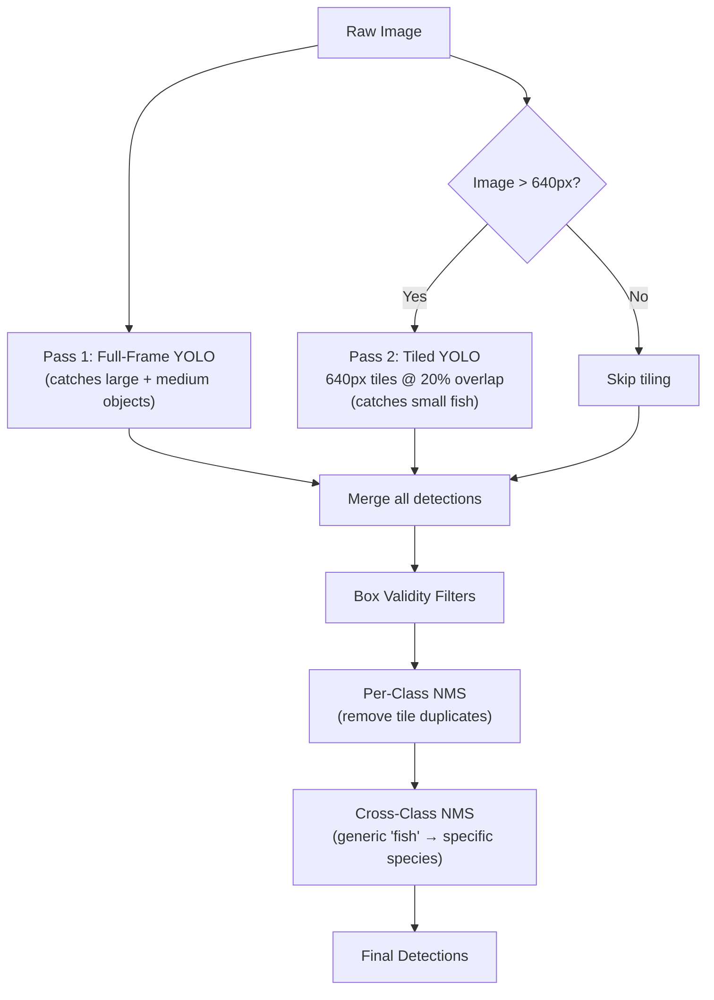
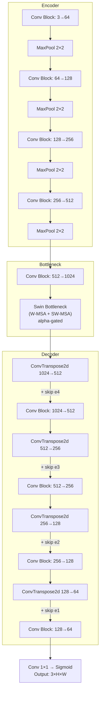
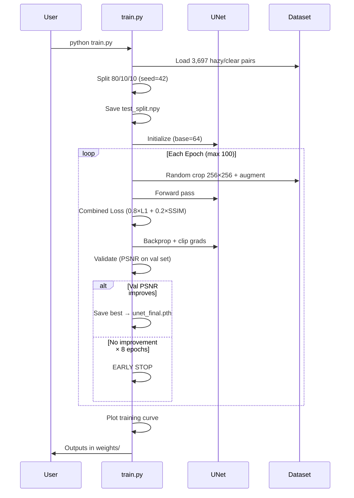
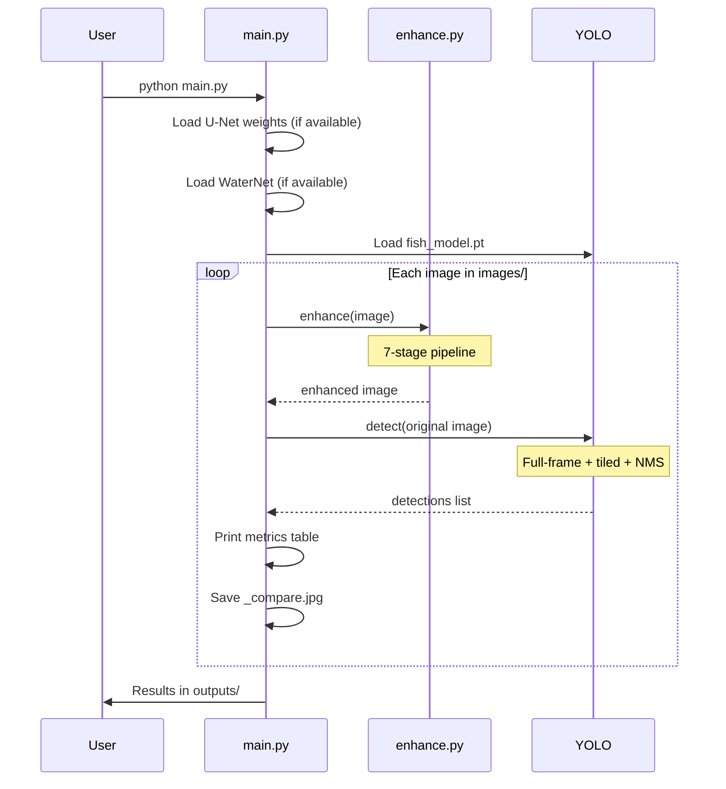
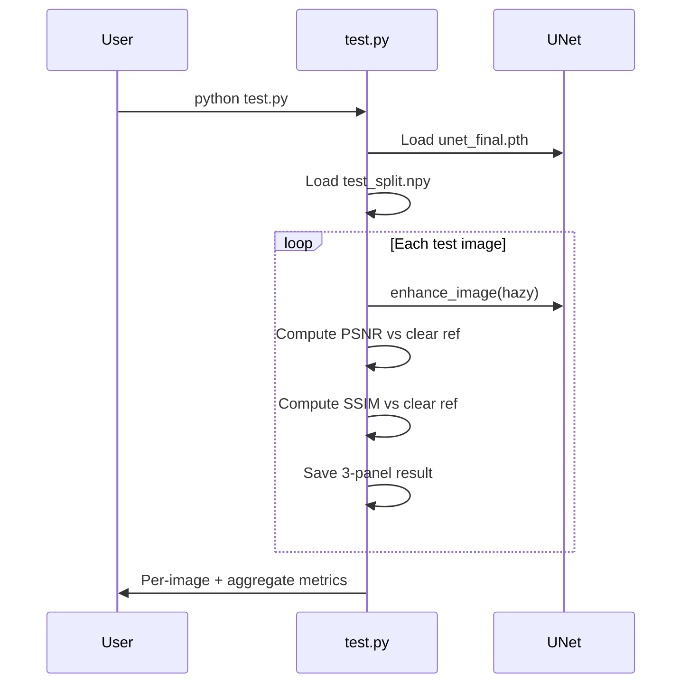

# Underwater Image Enhancement & Species Detection — Technical Report

> **Repository**: `UnderWater-Machine-Learning-Project/Underwater-Image-reconstruction`
> **Analysis Date**: 2026-04-19
> **Files**: 6 Python source files, 1 config, 1 requirements manifest, 1 pre-trained YOLO model (~84 MB)

---

## 1. Project Overview

This project implements a **two-stage pipeline** for underwater imagery:

| Stage | Purpose | Technique |
|-------|---------|-----------|
| **Stage 1 — Enhancement** | Reconstruct degraded underwater images to recover true color, contrast, and sharpness | Hybrid: U-Net + Swin Transformer (neural) + 7-step classical image processing chain |
| **Stage 2 — Detection** | Locate and classify marine species in the raw (un-enhanced) image | Two-pass tiled YOLOv8 with smart cross-class NMS |

**Output**: A side-by-side comparison JPEG (`_compare.jpg`) showing original + enhanced image with detection bounding boxes overlaid, plus a structured metrics table printed to the terminal.

---

## 2. Repository Structure

```
Underwater-Image-reconstruction/
├── main.py              # Entry point — orchestrates the full pipeline
├── enhance.py           # 7-stage enhancement engine + neural model loaders
├── unet.py              # U-Net + Swin Transformer architecture definition
├── train.py             # Training script for the U-Net enhancement model
├── test.py              # Evaluation script (PSNR/SSIM on held-out test set)
├── config.py            # I/O folder configuration
├── requirements.txt     # Python dependencies
├── fish_model.pt        # Pre-trained YOLOv8 species detection model (~84 MB)
├── .gitignore           # Excludes model weights, outputs, images
│
├── dataset/             # Training data
│   ├── hazy/            # 3,697 degraded underwater images
│   └── clear/           # 3,700 clean reference images
│
├── images/              # Input images for inference (6 test images present)
├── outputs/             # Generated comparison outputs
├── old_image/           # Legacy/archive (empty)
└── weights/             # Trained U-Net checkpoints (empty — needs training)
```

---

## 3. Tech Stack & Dependencies

| Dependency | Version | Role |
|-----------|---------|------|
| `torch` | ≥ 2.0.0 | Neural network framework (U-Net, Swin, inference) |
| `torchvision` | ≥ 0.15.0 | Image transforms, model utilities |
| `ultralytics` | ≥ 8.0.0 | YOLOv8 object detection framework |
| `opencv-python` | ≥ 4.8.0 | All classical image processing (CLAHE, dehazing, bilateral, etc.) |
| `numpy` | ≥ 1.24.0 | Array operations, metrics |
| `pillow` | ≥ 10.0.0 | Image I/O support |
| `tqdm` | ≥ 4.66.0 | Progress bars (training) |
| `matplotlib` | implicit | Training curve visualization (used in train.py) |

---

## 4. File-by-File Analysis

### 4.1 [config.py](file:///c:/Users/athar/Downloads/Underwater-Image-reconstruction/config.py) — 2 lines

Minimal configuration defining I/O folders. Currently **not imported** by any other file (main.py re-declares these constants). Acts as a shared config stub for future use.

```python
IMAGE_FOLDER = "images"
OUTPUT_FOLDER = "outputs"
```

---

### 4.2 [main.py](file:///c:/Users/athar/Downloads/Underwater-Image-reconstruction/main.py) — 253 lines

**The entry point and pipeline orchestrator.** Contains the detection engine, visualization, metrics, and the `main()` loop.

#### Key Constants

| Constant | Value | Purpose |
|----------|-------|---------|
| `CONF_THRESH` | 0.15 | Low confidence threshold to catch faint/occluded fish |
| `IOU_THRESH` | 0.45 | NMS IoU overlap threshold |
| `IMGSZ` | 640 | YOLO input resolution |
| `TILE_OVERLAP` | 0.20 | 20% overlap between detection tiles |
| `MIN_BOX_AREA` | 400 px² | Minimum bounding box area filter |
| `MAX_FRAME_FRAC` | 0.20 | Maximum box = 20% of frame (rejects whole-scene FPs) |
| `MAX_ASPECT` | 5.0 | Maximum aspect ratio (rejects non-fish shapes) |

#### Key Functions

| Function | Lines | Purpose |
|----------|-------|---------|
| `_valid()` | L63-68 | Box validity filter — area, frame fraction, aspect ratio |
| `_iou()` | L71-76 | IoU calculation between two boxes |
| `_nms()` | L79-114 | **Two-stage NMS**: per-class dedup → cross-class generic/specific collapse |
| `_forward()` | L117-120 | Single YOLO forward pass with box filtering |
| `_tiles()` | L123-139 | Generator yielding 640px tiles with overlap + edge padding |
| `detect()` | L142-153 | **Two-pass detection**: full-frame + tiled, then NMS merge |
| `_metrics()` | L158-160 | Compute area, diameter, circularity for each detection |
| `print_results()` | L163-176 | Pretty-print detection table to terminal |
| `_draw()` | L181-190 | Draw labeled bounding boxes on image |
| `_comparison()` | L193-195 | Create side-by-side `[detected original | detected enhanced]` |
| `process()` | L200-213 | Per-image pipeline: enhance → detect → print → save |
| `main()` | L216-253 | Load models, iterate images, run pipeline |

---

### 4.3 [enhance.py](file:///c:/Users/athar/Downloads/Underwater-Image-reconstruction/enhance.py) — 251 lines

**The 7-stage enhancement engine.** This is the most technically dense file.

#### Neural Model Loaders

| Function | Purpose |
|----------|---------|
| `load_unet()` | Load custom U-Net + Swin weights from `weights/unet_final.pth` |
| `infer_unet()` | Run U-Net inference: pad → forward → unpad → BGR |
| `load_waternet()` | Load WaterNet from `torch.hub` (tnwei/waternet) as fallback |
| `infer_waternet()` | Run WaterNet: preprocess → forward → postprocess |

#### Classical Processing Functions

| Function | Purpose |
|----------|---------|
| `_udcp_dehaze()` | Underwater Dark Channel Prior — R+G only (blue excluded) |
| `_msr_blend()` | Multi-Scale Retinex at 25% blend (fallback when no neural model) |

#### Master Enhancement Function: `enhance()`

The core 7-stage pipeline — see §5 below for full detail.

---

### 4.4 [unet.py](file:///c:/Users/athar/Downloads/Underwater-Image-reconstruction/unet.py) — 287 lines

**The neural architecture: U-Net with Swin Transformer bottleneck.**

#### Class Hierarchy

```
UNet (nn.Module)
├── _ConvBlock × 9         — Conv3x3 → BN → ReLU → Conv3x3 → BN → ReLU
├── nn.MaxPool2d           — 2×2 downsampling
├── SwinBottleneck
│   ├── Linear (in_proj)
│   ├── SwinBlock (W-MSA)  — Regular window attention
│   │   └── WindowAttention — Multi-head self-attention + relative position bias
│   ├── SwinBlock (SW-MSA) — Shifted window attention
│   │   └── WindowAttention
│   ├── Linear (out_proj)
│   └── alpha (Parameter)  — Gating parameter, initialized to 0
├── ConvTranspose2d × 4    — 2×2 upsampling
└── Conv2d (1×1) + Sigmoid — Final output layer
```

#### Architecture Dimensions

| Level | Encoder | Decoder |
|-------|---------|---------|
| Level 1 | 3 → 64 | 128 → 64 → 3 |
| Level 2 | 64 → 128 | 256 → 128 |
| Level 3 | 128 → 256 | 512 → 256 |
| Level 4 | 256 → 512 | 1024 → 512 |
| Bottleneck | 512 → 1024 → Swin → 1024 | — |

#### Swin Transformer Details

- **Window size**: 4×4 tokens (16 tokens per window at 16×16 bottleneck feature map)
- **Attention heads**: 8
- **Two blocks**: W-MSA (local) + SW-MSA (cross-window global)
- **Alpha gate**: `output = CNN_features + α × Swin_features` — starts at 0 for safe initialization
- **Relative position bias**: Learned 2D bias table for spatial awareness
- **Shifted window mask**: Prevents attention across non-adjacent window regions during cyclic shift

---

### 4.5 [train.py](file:///c:/Users/athar/Downloads/Underwater-Image-reconstruction/train.py) — 359 lines

**Training script for the U-Net enhancement model.**

#### Training Configuration

| Parameter | Value | Notes |
|-----------|-------|-------|
| Max Epochs | 100 | Terminated early by patience |
| Batch Size | 4 | Reduce to 2 for GPU OOM |
| Learning Rate | 1e-4 | AdamW + CosineAnnealing to 1e-6 |
| Image Size | 256×256 | Random crop during training |
| Early Stopping | 8 epochs patience | Monitors val PSNR |
| Split | 80/10/10 | Train / Val / Test |

#### UnderwaterDataset Class

- **Paired loading**: `hazy/001.jpg` ↔ `clear/001.jpg` by matching filenames
- **Synthetic degradation** (optional): If `SYNTHETIC = True`, simulates underwater degradation on clear images:
  - Red channel × 0.6 (absorption)
  - Green channel × 0.85
  - Blue channel × 1.1 + 0.05 (scatter boost)
  - Random haze addition (5–25%)
- **Augmentation**: Random horizontal/vertical flip + 90° rotations
- **Random crop**: 256×256 patches from full-res images

#### Loss Function: `CombinedLoss`

```
Loss = 0.8 × L1(pred, target) + 0.2 × (1 - SSIM(pred, target))
```

- L1 loss for pixel-level accuracy
- SSIM loss for structural/perceptual quality
- Window size 11 for SSIM computation

#### Training Loop Features

- **Gradient clipping**: `clip_grad_norm_(params, 1.0)` — prevents Swin attention gradient explosions
- **Swin alpha monitoring**: Logs `model.swin.alpha` each epoch to track when the transformer starts contributing
- **Cosine annealing LR**: Smoothly decays from 1e-4 to 1e-6 over training
- **Checkpointing**: Every 5 epochs + best model saved as `unet_final.pth`
- **CSV logging**: Per-epoch metrics to `training_log.csv`
- **Training curve**: Dual-axis plot (loss + PSNR) with early stop marker

#### Outputs

| File | Description |
|------|-------------|
| `weights/unet_final.pth` | Best checkpoint (highest val PSNR) |
| `weights/test_split.npy` | Held-out test image paths |
| `weights/training_log.csv` | Per-epoch metrics |
| `weights/training_curve.png` | Loss + PSNR elbow curve |

---

### 4.6 [test.py](file:///c:/Users/athar/Downloads/Underwater-Image-reconstruction/test.py) — 176 lines

**Evaluation script for the trained U-Net model.**

#### Metrics

| Metric | Good Threshold | Description |
|--------|----------------|-------------|
| PSNR | > 30 dB | Peak Signal-to-Noise Ratio |
| SSIM | > 0.85 | Structural Similarity Index |

#### Workflow
1. Load best weights from `weights/unet_final.pth`
2. Load held-out test paths from `weights/test_split.npy`
3. For each test image:
   - Run U-Net enhancement
   - Find matching clear reference image
   - Compute PSNR and SSIM against reference
   - Save 3-panel visualization: `[hazy | enhanced | clear]`
4. Print per-image + aggregate (avg/best/worst) metrics table

---

## 5. Enhancement Pipeline — Detailed Stage Breakdown



### Stage Details

| # | Stage | Technique | Key Parameters |
|---|-------|-----------|----------------|
| 1 | **LAB Chrominance Correction** | Detect blue/green cast from channel ratios → shift a/b axes in LAB space | Strength: `0.55 + 0.35 × cast`, cap: `30 + cast × 15` |
| 2 | **CLAHE + Adaptive Gamma** | CLAHE on L channel for local contrast → gamma correction for brightness | clipLimit=2.5, tile=8×8, gamma=0.50–0.90 |
| 3 | **Neural Enhancement** | U-Net+Swin (primary) → WaterNet (fallback) → MSR (classical fallback) | U-Net fed CLAHE base (not raw), 60/40 blend with base |
| 4 | **UDCP Dehazing** | Dark Channel Prior using only R+G channels (blue excluded for underwater) | omega=0.85, patch=15, skipped if dark/extreme cast |
| 5 | **Unsharp Mask** | Gaussian blur subtraction for edge sharpening | sigma=1.5, strength=0.35 |
| 6 | **Bilateral Denoise** | Edge-preserving smoothing | d=5, sigmaColor=25, sigmaSpace=25 |
| 7 | **Saturation Restore** | HSV saturation boost to compensate depth absorption | factor: `1.15 + 0.15 × cast` |

### Neural Model Priority Chain

```
U-Net + Swin (custom trained)
   ↓ (if weights missing or inference fails)
WaterNet (torch.hub pretrained)
   ↓ (if hub unavailable)
Multi-Scale Retinex (classical, always works)
```

### Safety Guard
The final output is compared against the original's brightness. If the enhanced image drops below 75% of the original mean brightness, the pipeline returns the original untouched — preventing catastrophic over-processing.

---

## 6. Detection Pipeline — Detailed Breakdown



### Box Validity Filters

| Filter | Condition | Purpose |
|--------|-----------|---------|
| Minimum area | ≥ 400 px² | Removes sub-pixel noise |
| Maximum area | ≤ 20% of frame | Removes whole-scene false positives |
| Aspect ratio | ≤ 5:1 | Removes non-fish-shaped artifacts |

### Two-Stage NMS

1. **Per-class NMS** (IoU > 0.45): Removes duplicate detections of the same species from overlapping tiles
2. **Cross-class NMS**: When a generic "fish" box overlaps with a species-specific box (e.g., "chaetodontidae"), the **specific label wins** and the generic is suppressed

### Tiling Strategy

- Tile size: 640×640 pixels
- Step size: `640 × (1 - 0.20) = 512 px`
- Edge tiles padded with zeros to maintain 640×640
- Coordinates mapped back to full-frame after inference

---

## 7. U-Net + Swin Transformer Architecture



### Why Swin at the Bottleneck?

| Design Choice | Rationale |
|---------------|-----------|
| **Only at bottleneck** | Feature map is 16×16 — attention is cheap. Encoder/decoder remain pure CNN for efficiency |
| **Two blocks (W-MSA + SW-MSA)** | W-MSA captures local haze patterns; SW-MSA shifts windows to create cross-window global context |
| **Alpha gate (init=0)** | Model starts as a plain U-Net. Swin contributes only after it learns useful representations. Prevents catastrophic initialization |
| **Window size 4** | At 16×16 bottleneck → 16 windows → 16 tokens per window. Extremely efficient |
| **Relative position bias** | Spatial awareness within windows — critical for understanding haze gradients |

---

## 8. Complete Execution Workflow

### 8.1 Training Flow (`python train.py`)



### 8.2 Inference Flow (`python main.py`)



### 8.3 Testing Flow (`python test.py`)



---

## 9. Data Flow Summary

```
┌─────────────────────────────────────────────────────────────────────────┐
│                        TRAINING PHASE                                   │
│                                                                         │
│  dataset/hazy/*.jpg ──┐                                                 │
│                       ├──→ train.py ──→ weights/unet_final.pth          │
│  dataset/clear/*.jpg ─┘       │        weights/test_split.npy           │
│     (3,697 pairs)             │        weights/training_log.csv         │
│                               │        weights/training_curve.png       │
│                               │                                         │
│                    test.py ←──┘                                         │
│                       │                                                 │
│                       └──→ test_outputs/*_result.jpg                    │
│                            PSNR / SSIM metrics                          │
├─────────────────────────────────────────────────────────────────────────┤
│                        INFERENCE PHASE                                  │
│                                                                         │
│  images/*.jpg ───────→ main.py                                          │
│  fish_model.pt ──────→   │  ←── weights/unet_final.pth (optional)       │
│                          │  ←── WaterNet via torch.hub (fallback)        │
│                          │  ←── Classical MSR + UDCP   (always works)    │
│                          │                                               │
│                          └──→ outputs/*_compare.jpg                      │
│                               Terminal metrics table                     │
└─────────────────────────────────────────────────────────────────────────┘
```

---

## 10. Current State & Key Observations

### What's Working
- ✅ **Full inference pipeline** operational — `main.py` runs end-to-end
- ✅ **YOLO detection** functional with `fish_model.pt` (84 MB pre-trained)
- ✅ **Classical enhancement** works as fallback (no neural weights required)
- ✅ **Dataset present**: 3,697 hazy + 3,700 clear image pairs ready for training
- ✅ **6 test images** present with generated comparison outputs in `outputs/`
- ✅ **Robust error handling**: graceful fallback chain, brightness safety guard

### What Needs Attention
- ⚠️ **`weights/` directory is empty** — U-Net has not been trained yet. Pipeline currently runs on classical enhancement only
- ⚠️ **`config.py` is unused** — `main.py` re-declares `IMAGE_FOLDER` and `OUTPUT_FOLDER` independently
- ⚠️ **3 unpaired images** — 3,700 clear vs 3,697 hazy (3 clear images have no hazy counterpart)
- ⚠️ **No requirements for matplotlib** — `train.py` imports it but `requirements.txt` doesn't list it
- ⚠️ **No `SS_UIE.pth` present** — README mentions an optional WaterNet alternative download

### Architecture Strengths
- 🏗️ **Clean modular separation**: detection (`main.py`), enhancement (`enhance.py`), model (`unet.py`), training (`train.py`), evaluation (`test.py`)
- 🏗️ **Graceful degradation**: Neural → Fallback → Classical chain ensures the pipeline always runs
- 🏗️ **Smart NMS design**: Two-stage NMS (per-class + cross-class generic collapse) is well-engineered
- 🏗️ **Production-quality UDCP**: Modified dark channel prior using only R+G channels is a domain-specific insight that prevents blue-channel-induced over-dehazing
- 🏗️ **Alpha-gated Swin**: Safe integration of transformer into CNN via learnable gate that starts disabled

---

## 11. Execution Commands

```bash
# Install dependencies
pip install -r requirements.txt

# Run inference (enhancement + detection)
python main.py

# Train the U-Net model (requires dataset)
python train.py

# Evaluate on held-out test set (requires trained weights)
python test.py
```
